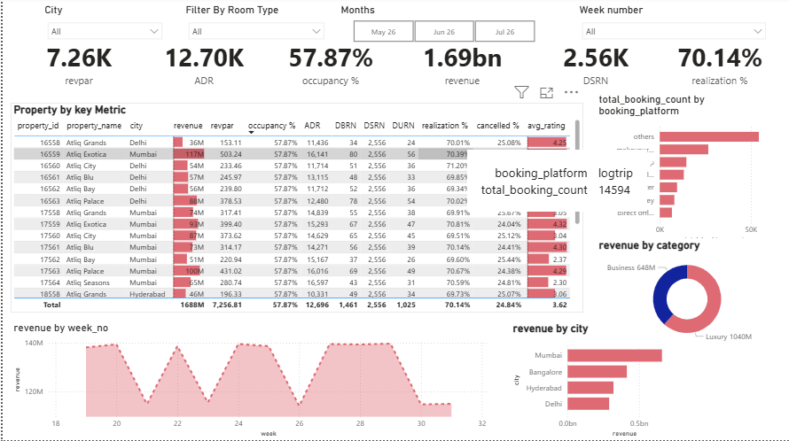
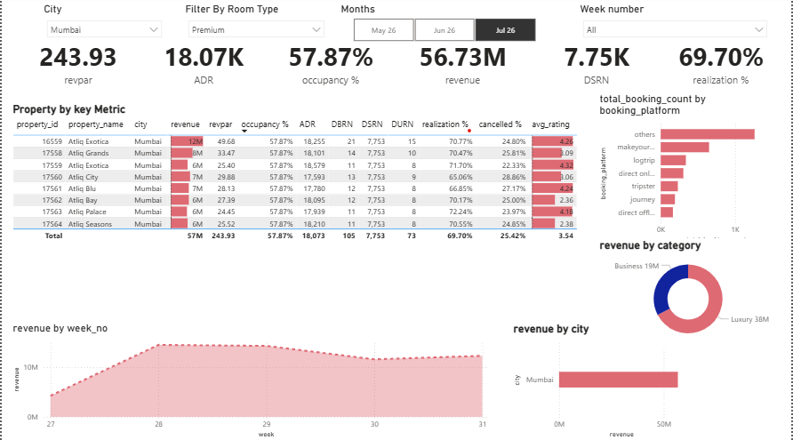

# 🏨 Hospitality Revenue Intelligence — AtliQ Hotels Case Study

<div align="center">


**Interactive Power BI dashboard tracking ₹1.69 Billion in hotel revenue across 4 Indian cities**  
*RevPAR · ADR · Occupancy · Booking Platform Mix · City & Room-Level Drill-Down*

[📊 View Dashboard](#-dashboard) · [📐 Data Model](#-data-model) · [🔍 Key Findings](#-key-findings) · [💡 Business Insights](#-business-insights) · [⚙️ Setup](#️-setup)

</div>

---

## 📌 Project Overview

AtliQ Hotels operates a chain of **luxury and business properties** across Delhi, Mumbai, Hyderabad, and Bangalore. This Power BI dashboard was built to give revenue managers a **single pane of glass** across all properties, room types, booking platforms, and time periods — enabling faster, data-driven decisions.

**The core business problem:** Leadership had no centralized way to compare property performance, identify occupancy gaps, or understand which booking channels were most profitable.

**The solution:** A fully interactive, filter-driven dashboard built on a clean **star schema data model** using industry-standard hospitality KPIs — the same metrics used by real hotel revenue management teams globally.

---

## 📊 Dashboard

### Full Portfolio View — All Cities, All Rooms, May–Jul



> **₹1.69B revenue · 14,594 bookings · 57.87% occupancy · 24.84% cancellation rate**

---

### Filtered View — Mumbai · Premium Rooms · July 2026



> **Filter applied**: City = Mumbai · Room Type = Premium · Month = Jul 26  
> Revenue drops to ₹56.73M | ADR jumps to ₹18,073 | RevPAR = 243.93 | Luxury ₹38M vs Business ₹19M  
> This demonstrates how the dashboard dynamically isolates any segment for deep-dive analysis.

---

## 📐 Data Model

Built on a **star schema** — the industry standard for BI performance and scalability:

```
                    ┌─────────────┐
                    │  dim_date   │
                    │ (calendar)  │
                    └──────┬──────┘
                           │
┌─────────────┐    ┌───────┴────────┐    ┌─────────────┐
│  dim_hotels │────│ fact_bookings  │────│  dim_rooms  │
│ (properties)│    │  (main fact)   │    │ (room types)│
└─────────────┘    └───────┬────────┘    └─────────────┘
                           │
               ┌───────────┴────────────┐
               │ fact_aggregated_       │
               │ bookings               │
               └────────────────────────┘
```

| Table | Type | Description |
|---|---|---|
| `dim_hotels` | Dimension | Property ID, name, city, category (Luxury/Business) |
| `dim_rooms` | Dimension | Room class — Standard, Elite, Premium, Presidential |
| `dim_date` | Dimension | Calendar table — week number, month, day type |
| `fact_bookings` | Fact | Individual booking records with revenue, ratings, platform |
| `fact_aggregated_bookings` | Fact | Pre-aggregated metrics for occupancy calculations |

---

## 📈 KPI Reference — What Each Metric Means

These are real hospitality industry KPIs — not generic metrics:

| KPI | Full Name | Formula | Why It Matters |
|---|---|---|---|
| **RevPAR** | Revenue Per Available Room | Revenue ÷ Total Available Rooms | Core profitability measure — combines price AND occupancy |
| **ADR** | Average Daily Rate | Revenue ÷ Rooms Sold | Pricing efficiency — ignores unsold rooms |
| **DSRN** | Daily Sellable Room Nights | Total sellable rooms per day | Capacity baseline for all rate calculations |
| **DURN** | Daily Utilized Room Nights | Rooms actually occupied per day | Actual demand signal |
| **DBRN** | Daily Booked Room Nights | Total booked per day (incl. future) | Forward-looking demand |
| **Realization %** | Revenue Realization | Actual Revenue ÷ Potential Revenue | Efficiency — accounts for discounts, cancellations |
| **Occupancy %** | Occupancy Rate | DURN ÷ DSRN | Classic hotel utilization metric |

---

## 🔍 Key Findings

### 1. Overall Portfolio Performance (May–Jul)

| KPI | Value | Benchmark / Signal |
|---|---|---|
| **Total Revenue** | ₹1.69 Billion | Across all cities and room types |
| **RevPAR** | ₹7,256 | Luxury benchmark: ₹10,000+ — room to improve |
| **ADR** | ₹12,696 | Healthy for mid-luxury segment |
| **Occupancy %** | 57.87% | Below luxury benchmark of 65–70% |
| **Realization %** | 70.14% | ~30% revenue lost to cancellations/discounts |
| **Cancellation Rate** | 24.84% | ⚠️ Industry avg ~20% — above benchmark |
| **Avg Rating** | 3.62 / 5 | Below good-tier threshold of 4.0 |
| **Total Bookings** | 14,594 | Across all platforms and properties |

---

### 2. Luxury vs. Business Split

| Category | Revenue | Share |
|---|---|---|
| Luxury | ₹1,040M | 61.5% |
| Business | ₹648M | 38.5% |

Luxury properties generate 60%+ of revenue at higher ADR — but occupancy is identical across both, suggesting **pricing power, not demand**, drives the gap.

**Filtered Insight (Mumbai · Premium · July):** Luxury ₹38M vs. Business ₹19M — the split widens further when isolating premium room types in high-performing cities. ADR of ₹18,073 in this segment vs. ₹12,696 overall confirms premium rooms command a 42% price premium.

---

### 3. Property-Level Performance

| Property | City | Revenue | RevPAR | ADR | Realization | Avg Rating |
|---|---|---|---|---|---|---|
| **Atliq Exotica** | Mumbai | ₹117M | 503 | 16,141 | 70.39% | 4.32 ⭐ |
| Atliq Palace | Delhi | ₹88M | 378 | 12,480 | 70.62% | 4.29 ⭐ |
| Atliq Grands | Delhi | ₹86M | 153 | 11,436 | 70.01% | 4.25 ⭐ |
| Atliq Blu | Delhi | ₹57M | 245 | 13,115 | 69.85% | — |
| Atliq City | Delhi | ₹54M | 233 | 17,593 | 71.20% | — |
| **Atliq Seasons** | Mumbai | ₹65M | 280 | 18,210 | 70.55% | **2.38 ⭐** |
| Atliq Grands | Hyderabad | ₹46M | 196 | 10,331 | 69.73% | 3.06 ⭐ |

> **Top performer**: Atliq Exotica Mumbai — highest revenue AND rating.  
> **Critical flag**: Atliq Seasons Mumbai — highest ADR (₹18,210) but rating of only 2.38. Guests are paying premium prices and leaving disappointed. This is a guest experience crisis.

---

### 4. Booking Platform Analysis

| Platform | Share | Business Implication |
|---|---|---|
| LogTrip | Highest | Dominant OTA — drives volume but costs 15–20% commission |
| MakeYourTrip | Second | Major Indian OTA — similar commission structure |
| Direct Online | Third | **Highest margin** — no commission paid |
| Tripster / Journey | Mid-tier | Niche platforms with lower volume |
| Direct Offline | Lower | Walk-in / corporate contracts |

**The problem:** OTAs dominate bookings but are the least profitable channel. Every ₹100 booked through LogTrip nets approximately ₹80–85 after commission vs. ₹100 direct.

---

### 5. Weekly Revenue Pattern

The revenue-by-week chart shows a **clear cyclical pattern** — peaks in weeks 24, 27, 29, and 31, with troughs between. This is consistent with **weekend leisure demand** alternating with slower mid-week periods.

**Implication:** Mid-week corporate rate packages or event-tied promotions can smooth the dip weeks and improve overall RevPAR.

---

### 6. Revenue by City

| City | Revenue Rank | Notes |
|---|---|---|
| Mumbai | 1st 🏆 | Highest per-property yield; luxury segment dominates |
| Bangalore | 2nd | Strong performance with fewer properties |
| Hyderabad | 3rd | Growth market; currently underperforming vs. market size |
| Delhi | 4th | Most properties, lowest revenue yield per property |

---

## 💡 Business Insights

### Revenue & Pricing
- **Raise ADR on Atliq Exotica Mumbai** — 4.32 rating + high demand = pricing power underutilized
- **Dynamic pricing for peak weeks** (24, 27, 29, 31) — demand is predictable; rates should follow
- **Atliq Seasons paradox**: highest ADR but lowest rating — investigate if guests feel the price isn't justified

### Cancellation Recovery
- At 24.84% cancellation rate, **₹84M+ in potential revenue is being lost** assuming 5% is recoverable
- **Implement non-refundable discount tiers** (e.g., 10% off for non-refundable bookings)
- **Overbooking strategy** for high-demand weeks with full cancellation history data

### Channel Mix Optimization
- **Target: grow direct bookings from ~25% to 35%** — each 1% shift saves approximately ₹1.69M in commission
- **LogTrip partnership terms** should be renegotiated — dominant platform position gives leverage
- **Corporate tie-ups in Delhi** — city has most properties but lowest yield; B2B contracts with nearby businesses can stabilize mid-week occupancy

### Guest Experience
- **Atliq Seasons Mumbai (2.38 rating) is a brand liability** — one bad-rated property can contaminate the entire chain's perception on OTA platforms
- **Overall 3.62 rating is below the "recommended" threshold of 4.0** on most OTAs — impacts search ranking

---

## 📁 Repository Structure

```
Hotels-Data-analysis-Powerbi-dashboard/
│
├── data/
│   ├── dim_date.csv                    # Calendar dimension
│   ├── dim_hotels.csv                  # Property master data (city, category)
│   ├── dim_rooms.csv                   # Room type dimension
│   ├── fact_bookings.csv               # Individual booking transactions
│   └── fact_aggregated_bookings.csv    # Pre-aggregated occupancy metrics
│
├── dashboard.pbix                      # Power BI source file (fully interactive)
├── Hotels_Dashboard.png                # Full portfolio view screenshot
├── filter.png                          # Filtered view: Mumbai · Premium · Jul 26
└── README.md
```

---

## ⚙️ Setup

**Requirements**: Power BI Desktop (free — [download here](https://powerbi.microsoft.com/desktop/))

```bash
# Clone the repo
git clone https://github.com/haseeb774/Hotels-Data-analysis-Powerbi-dashboard.git
cd Hotels-Data-analysis-Powerbi-dashboard
```

1. Open `dashboard.pbix` in Power BI Desktop
2. All data loads automatically from the `/data` folder — no database or API needed
3. Use the slicers to filter by **City · Room Type · Month · Week Number**
4. All KPIs (RevPAR, ADR, Occupancy, Realization) update in real time with every filter change

---

## 🏨 Dataset

Hospitality domain dataset modeled on real hotel chain operations:

- **14,594** booking records across May–July
- **7 properties** across 4 Indian cities (Delhi, Mumbai, Hyderabad, Bangalore)
- **4 room categories**: Standard · Elite · Premium · Presidential
- **2 hotel categories**: Luxury · Business
- **6+ booking platforms**: LogTrip, MakeYourTrip, Direct Online, Tripster, Journey, Direct Offline

---

## 👤 Author

**Haseeb ur Rehman**  
Data Analyst · Power BI · SQL · Python

[](https://github.com/haseeb774)
[](https://linkedin.com/in/haseeb-u-rehman-4822bb369)

---

<div align="center">
<i>If this project was useful, consider leaving a ⭐</i>
</div>